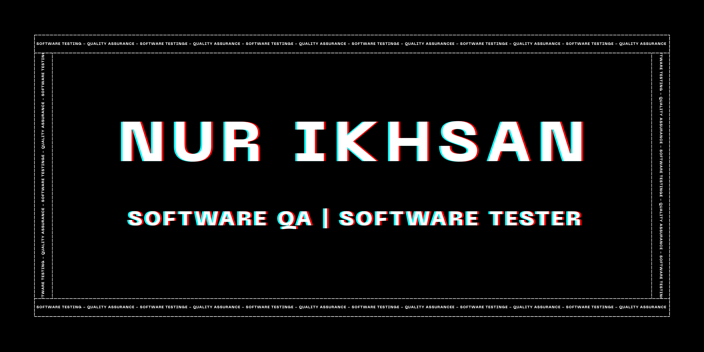

<!-- ======================= HEADER ======================= -->

<p align="center">
  
</p>
<!-- ======================= ABOUT ======================= -->

## 👨‍💻 About Me

I'm an Information Systems graduate with a strong interest in
Software Quality Assurance and Software Testing.

I enjoy exploring how software behaves, identifying defects,
designing test scenarios, and documenting testing results to
help improve software quality.

Currently, I'm focusing on developing my skills in:

- 🧪 Manual Testing
- 🔌 API Testing
- 📋 Test Case & Test Scenario Design
- 🐛 Bug Reporting & Defect Documentation
- 🗃️ SQL & Database Testing
- 🎭 Test Automation with Playwright
- 🔧 Git & GitHub


<!-- ======================= TESTING ======================= -->

## 🧪 Software Testing Skills

| Area | Skills |
|------|--------|
| Functional Testing | Test Case Design, Test Scenario, Boundary Value Analysis, Equivalence Partitioning |
| API Testing | REST API, HTTP Methods, Status Codes, Request & Response Validation |
| Database Testing | SQL, Data Validation, CRUD |
| Defect Management | Bug Report, Severity, Priority, Reproduction Steps |
| Test Documentation | Test Plan, Test Case, Test Result, Test Report |
| Automation | Playwright |
| Development Workflow | Git, GitHub, Agile / Scrum |


<!-- ======================= TOOLS ======================= -->

## 🛠️ Tools & Technologies

<p align="center">
<div align="center">
  
  
  
  
  
  
  
  
  
  
  
  
  
  
  
  
  
  
  
  
  
  
  
  
  
  
  
  
</div>


<!-- ======================= PROJECTS ======================= -->

## 📂 Featured QA Projects

### 🔹 ELISTA — Functional Testing

Functional testing of an academic information system using
Black Box Testing and an end-to-end testing approach.

**Activities:**

- Test scenario & test case design
- Functional testing
- Boundary Value Analysis
- Equivalence Partitioning
- Defect identification
- Bug documentation
- Test result documentation

👉 **[View Project](#)**


### 🔹 API Testing

A collection of REST API testing exercises using Postman.

**Covered:**

- HTTP methods
- Request anatomy
- Headers & authentication
- Status code validation
- Response validation
- Schema / contract validation
- Negative testing
- Boundary Value Analysis
- Error handling

👉 **[View Project](#)**


### 🔹 QA Portfolio Website

A collection of software testing documentation and projects
showcasing my approach to testing software applications.

**Includes:**

- Test Cases
- Bug Reports
- Test Scenarios
- Test Results
- API Testing
- Testing Documentation

👉 **[View Portfolio](https://github.com/calonsarjanaa/quality-assurance-portfolio)**


<!-- ======================= GITHUB STATS ======================= -->

## 📊 GitHub Stats

<p align="center">
  <a href="https://ghstats.dev/api/card?username=calonsarjanaa&theme=radical&border_radius=6.5">
    
  </a>
</p>


<!-- ======================= CONTRIBUTION ======================= -->

## 🔥 Contribution

<p align="center">
  
</p>


<!-- ======================= CURRENT FOCUS ======================= -->

## 🎯 Currently Learning

```text
Software Testing
      │
      ├── API Testing
      │     ├── REST API
      │     ├── HTTP
      │     ├── Status Code
      │     └── Response Validation
      │
      ├── Database Testing
      │     └── SQL
      │
      └── Automation
            └── Playwright
